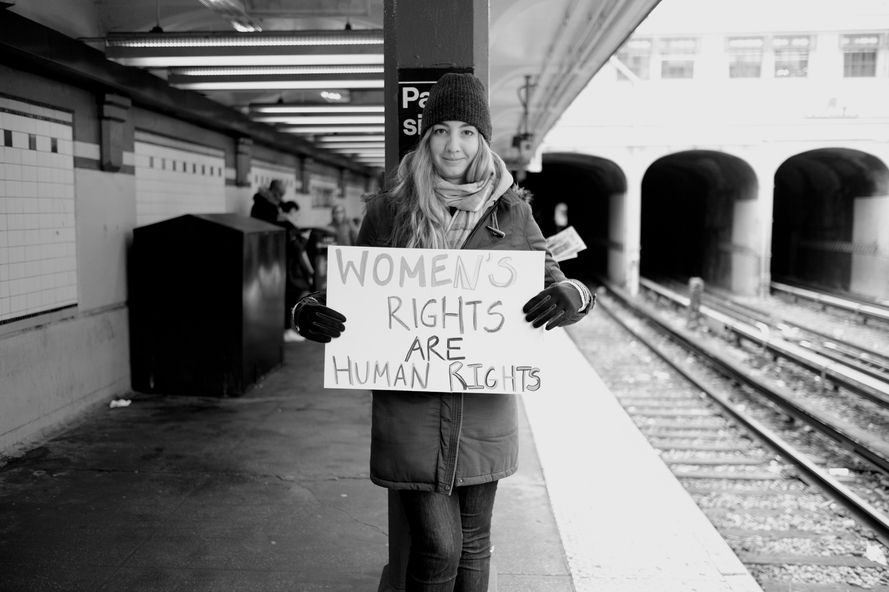
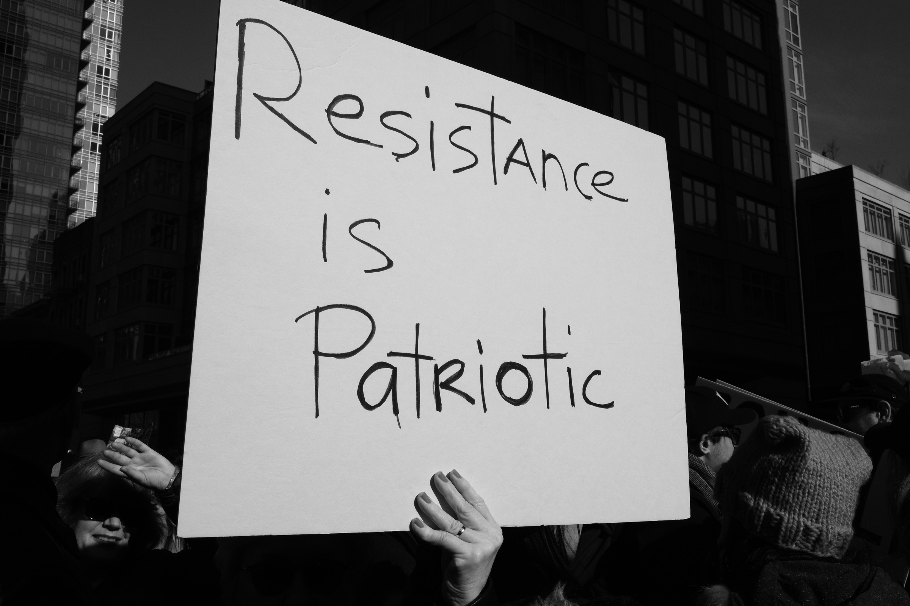
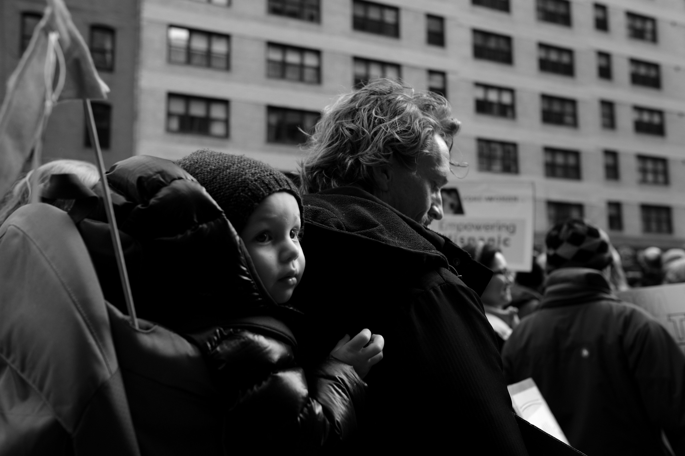
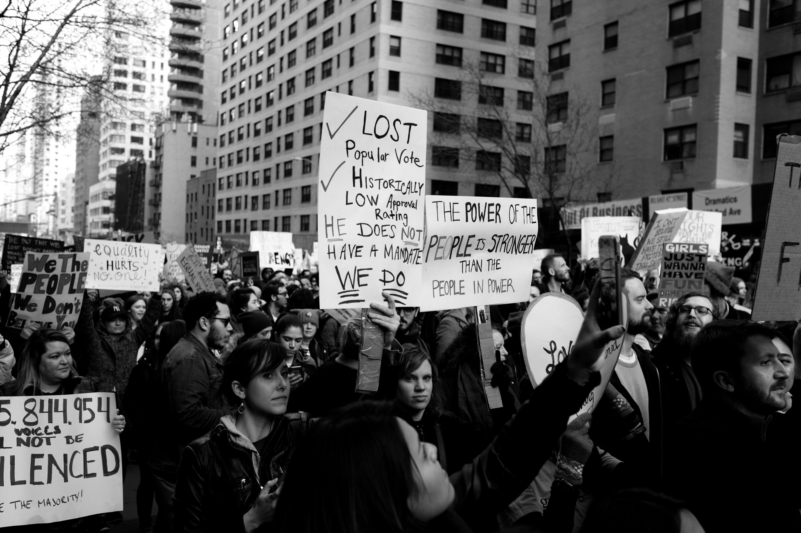
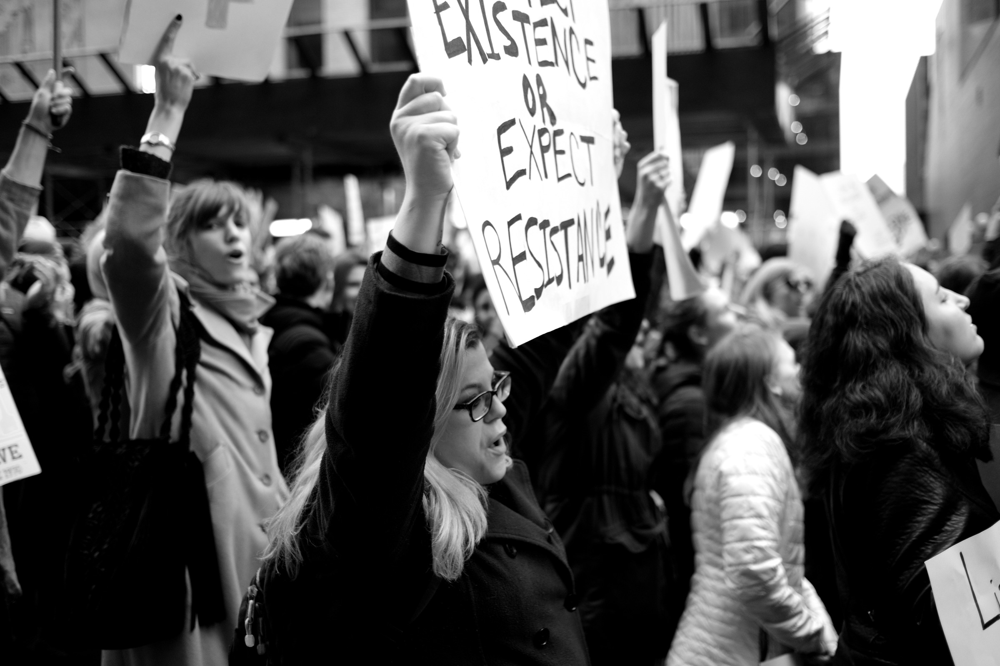

# Women's rights are human rights

Day 14,918

Today was an important day. Another historic day. People all over the country, all over the world, got out in the streets and marched for Women. Marched for equality, rights, and everything else.

I wasn't planning to go. I have been under the weather the last couple days, and I don't _love_ crowds. But I rallied, and decided to go and support my soon to be wife. 

It was really something to see in New York City. We never made it all the way to the High Castle. There were just too many people. But we marched, and I took all these photos.

See a typo? Submit a [pull-request]()!